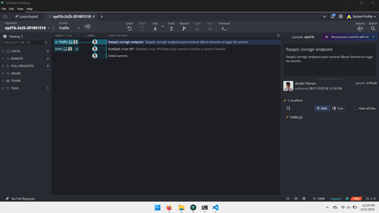

# ayd1b-2s25-201801518
En esta tarea deberán desarrollar una API REST que muestre su nombre junto con el nombre de su canción favorita, para luego crear un tag de versión que marque esta entrega inicial. Posteriormente, deberán crear una rama de corrección para modificar la API, reemplazando la canción por el nombre de un álbum.

# Evidencias de la Tarea 1

## Punto 1: API muestra nombre y canción favorita

## Punto 3: API muestra nombre y álbum favorito (hotfix)

## Capturas con mejor calidad y de todos los pasos

